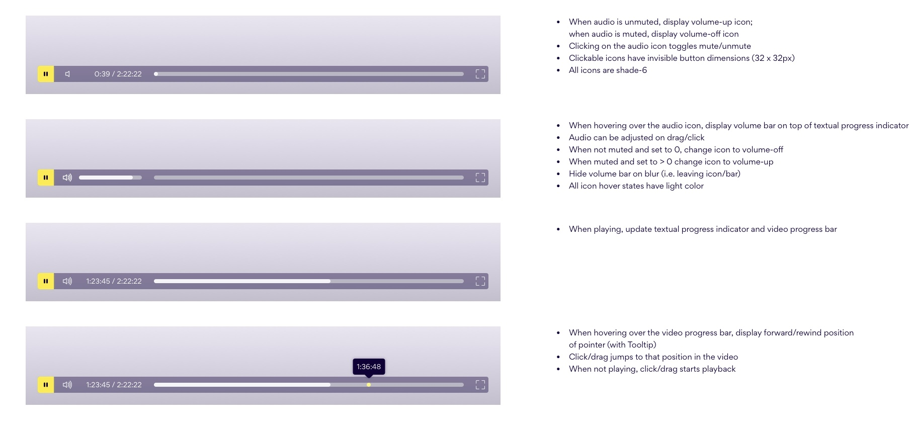
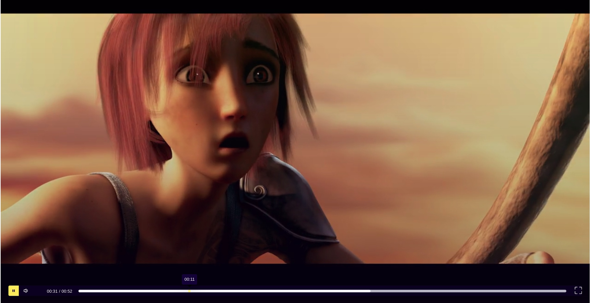

## Videplayer 

<span>


</span>


**Build with Custom Hooks**


:popcorn: Enjoy the [Live Demo](https://mandyneumeyer.github.io/todo_app/)



---



## Setup

 ```
   clone repository
   ```
 ```
   cd <your-repository-name>
   npm install
   ```
 ```
   npm start
   ```
 ```
   Enjoy 🍿
   ```

